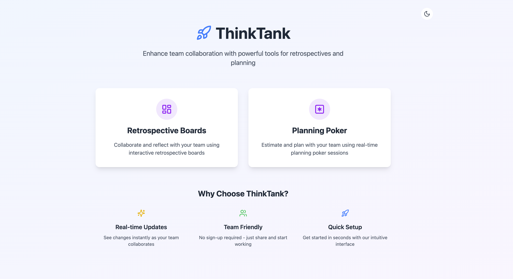

# ThinkTank - Planning Poker & Retrospective Boards

<div align="center">
  
  <p><strong>Enhance team collaboration with powerful tools for retrospectives and planning</strong></p>
  <p>
    <a href="https://thinktank-app.vercel.app">View Demo</a>
    ·
    <a href="#features">Features</a>
    ·
    <a href="#getting-started">Getting Started</a>
    ·
    <a href="#installation">Installation</a>
  </p>
</div>

## About ThinkTank

ThinkTank is a modern collaboration platform for agile teams, offering essential tools to run effective meetings, plan sprints, and conduct retrospectives. With ThinkTank, remote teams can collaborate in real-time using Planning Poker for estimation and Retrospective Boards for team reflection.

<div align="center">
  
</div>

## Features

### 🎮 Planning Poker

- **Anonymous Voting**: Prevent anchoring bias by keeping votes hidden until reveal
- **Real-time Collaboration**: Instantly see when team members cast their votes
- **Voting Statistics**: View result distribution and consensus details
- **Custom Voting Scales**: Standard Fibonacci sequence (1, 2, 3, 5, 8, 13...)

### 📋 Retrospective Boards

- **Customizable Sections**: "What went well", "What to improve", and more
- **Real-time Updates**: Collaborative editing with instant synchronization
- **Drag and Drop**: Organize and prioritize feedback
- **Action Item Tracking**: Convert feedback into actionable tasks

### 🚀 General Features

- **No Account Required**: Get started in seconds
- **Shareable URLs**: Generate unique room links to invite team members
- **Dark Mode**: Toggle between light and dark themes
- **Responsive Design**: Works on desktop, tablet, and mobile devices
- **Firebase Backend**: Reliable real-time database with Firestore

## Technologies Used

- **Frontend**: React.js, TypeScript, Tailwind CSS
- **Backend**: Firebase (Firestore)
- **State Management**: React Context API
- **Deployment**: Vercel

## Getting Started

### Prerequisites

- Node.js 16+
- npm or yarn
- Firebase account (free tier works)

### Installation

1. Clone the repository

   ```bash
   git clone https://github.com/harshloco/thinktank.git
   cd thinktank
   ```

2. Install dependencies

   ```bash
   npm install
   # or
   yarn install
   ```

3. Set up environment variables
   Create a `.env.local` file in the root directory with your Firebase configuration:

   ```
   VITE_FIREBASE_API_KEY=your-api-key
   VITE_FIREBASE_AUTH_DOMAIN=your-auth-domain
   VITE_FIREBASE_PROJECT_ID=your-project-id
   VITE_FIREBASE_STORAGE_BUCKET=your-storage-bucket
   VITE_FIREBASE_MESSAGING_SENDER_ID=your-messaging-sender-id
   VITE_FIREBASE_APP_ID=your-app-id
   ```

4. Start the development server

   ```bash
   npm run dev
   # or
   yarn dev
   ```

5. Open [http://localhost:5173](http://localhost:5173) to view the app in your browser

## Deployment

The application is deployed using Vercel. Any push to the main branch will trigger a new deployment.

To deploy manually:

```bash
npm run build
# then deploy using your preferred hosting service
```

## Contributing

Contributions are welcome! Please feel free to submit a Pull Request.

1. Fork the project
2. Create your feature branch (`git checkout -b feature/amazing-feature`)
3. Commit your changes (`git commit -m 'Add some amazing feature'`)
4. Push to the branch (`git push origin feature/amazing-feature`)
5. Open a Pull Request

## License

This project is licensed under the MIT License - see the [LICENSE](LICENSE) file for details.

## Contact

Harshpreet Singh- [singh.harshpreet@outlook.com](mailto:singh.harshpreet@outlook.com)

Project Link: [https://github.com/harshloco/thinktank](https://github.com/harshloco/thinktank)
